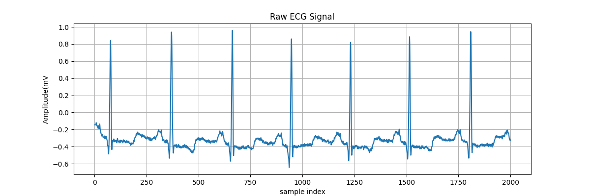

# ECG Arrhythmia Classification using Machine Learning & Deep Learning

This project detects abnormal heartbeats using real ECG data and artificial intelligence.

## Dataset
MIT-BIH Arrhythmia Database (PhysioNet)

## Pipeline
- ECG signal loading
- Bandpass filtering
- R-peak based heartbeat segmentation
- Feature extraction
- Machine learning classification
- Deep learning using LSTM

## Models Used
- Logistic Regression
- Support Vector Machine
- Random Forest
- LSTM Neural Network

## Results
Random Forest gave the best classical ML performance.  
The LSTM achieved ~98% accuracy.

## Tools
Python, NumPy, SciPy, Scikit-Learn, PyTorch, WFDB

## Signal Processing Results

### Raw ECG Signal

### Raw vs Filtered ECG

### Sample Heartbeat Segments

